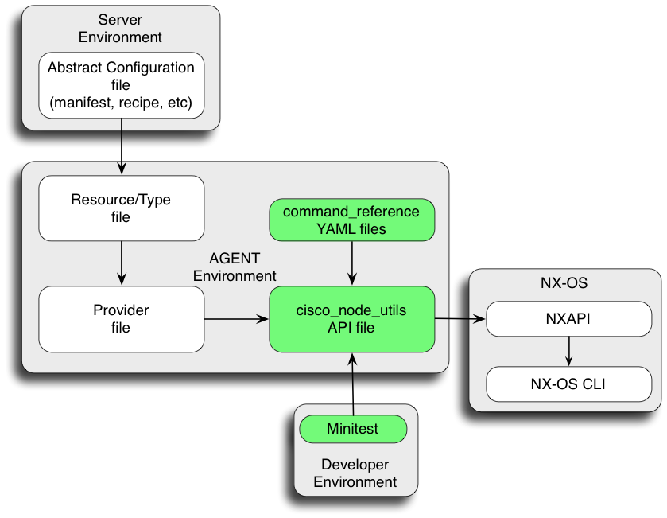

# How To Create New node_utils APIs

#### Table of Contents

* [Overview](#overview)
* [Before You Begin](#prerequisites)
* [Start here: Fork and Clone the Repo](#clone)
* [Example: router eigrp](#complex)
 * [Step 1. YAML Definitions: router eigrp](#comp_yaml)
 * [Step 2. Create the node_utils API: router eigrp](#comp_api)
 * [Step 3. Create the Minitest: router eigrp](#comp_minitest)
 * [Step 4. rubocop / lint: router eigrp](#comp_lint)
 * [Step 5. Build and Install the gem](#comp_gem)

## <a name="overview">Overview</a>

This document is a HowTo guide for writing new cisco_node_utils APIs. The APIs act as an interface between the NX-OS CLI and an agent's resource/provider. If written properly the new API will work as a common framework for multiple providers (Puppet, Chef, etc).  In addition to this guide, please reference the [cisco_node_utils development 'best practices' guide.](./README-develop-best-practices.md)

There are multiple components involved when creating new resources. This document focuses on the cisco_node_utils API, command reference YAML files, and minitests.



## <a name="prerequisites">Before You Begin</a>

Please note: A virtual Nexus N9000/N3000 may be helpful for development and testing. Users with a valid [cisco.com](http://cisco.com) user ID can obtain a copy of a virtual Nexus N9000/N3000 by sending their [cisco.com](http://cisco.com) user ID in an email to <get-n9kv@cisco.com>. If you do not have a [cisco.com](http://cisco.com) user ID please register for one at [https://tools.cisco.com/IDREG/guestRegistration](https://tools.cisco.com/IDREG/guestRegistration)

This development guide uses tools that are packaged as gems that need to be installed on your server.

```bash
gem install cisco_nxapi
gem install rake
gem install rubocop
gem install simplecov
gem install minitest
```

**NOTE:** If you are working from a server where you don't have admin/root privilages, use the following commands to install the gems and then update the `PATH` to include `~/.gem/ruby/x.x.x/bin`

```bash
gem install --user-install cisco_nxapi
gem install --user-install rake
gem install --user-install rubocop
gem install --user-install simplecov
gem install --user-install minitest
```

## <a name="clone">Start here: Fork and Clone the Repo</a>

First [fork](https://help.github.com/articles/fork-a-repo) the [cisco-network-node-utils](https://github.com/cisco/cisco-network-node-utils) git repository 

Next install the code base. Clone the cisco-network-node-utils repo from your fork into a workspace:

```bash
git clone https://github.com/YOUR-USERNAME/cisco-network-node-utils.git
cd cisco-network-node-utils/
```

Please note that any code commits must be associated with your github account and email address. If you intend to commit code to this repository then use the following commands to update your workspace with your credentials:

```bash
git config --global user.name "John Doe"
git config --global user.email johndoe@example.com
```

As a best practice create a topic/feature branch for your feature work using the `git branch feature/<feature_name>` command.

```bash
git branch feature/eigrp
git branch
* develop
  feature/eigrp
```


## <a name="complex">Example: router eigrp</a>

Before you start working on the eigrp feature, checkout the feature branch you created earlier.

```bash
git checkout feature/eigrp
git branch
  develop
* feature/eigrp
```

`router eigrp` requires feature enablement and supports multiple eigrp instances. It also has multiple configuration levels for vrf and address-family.

For the purposes of this example we will only implement the following properties:

```bash
[no] feature eigrp               (boolean)
[no] router eigrp [name]         (string)
       maximum-paths [n]         (integer)
       [no] shutdown             (boolean)

Example:
  feature eigrp
  router eigrp Blue
    maximum-paths 5
    shutdown
```

### <a name="comp_yaml">Step 1. YAML Definitions: router eigrp</a>

The new API for `router eigrp` will need some basic YAML definitions. By convention we create a new YAML file to handle a new feature set, so we will create
the following file:

`lib/cisco_node_utils/cmd_ref/eigrp.yaml`

YAML files in the `/cmd_ref/` subdirectory are automatically discovered at runtime, so we don't need to do anything special once we have created this file

The following basic command_reference parameters will be defined for each resource property:

 1. `config_get:` This defines the NX-OS CLI command (usually a 'show...' command) used to retrieve the property's current configuration state. Note that some commands may not be present until a feature is enabled.
 2. `config_get_token:` A regexp pattern for extracting state values from the config_get output.
 3. `config_set:` The NX-OS CLI configuration command(s) used to set the property configuration. May contain wildcards for variable parameters.
 4. `default_value:` This is typically the "factory" default state of the property, expressed as an actual value (true, 12, "off", etc)
 5. `kind:` The data type of this property. If omitted, the property will be a string by default. Commonly used values for this property are `int` and `boolean`.
 6. `multiple:` By default a property is assumed to be found once or not at all by the `config_get`/`config_get_token` lookup, and an error will be raised if multiple matches are found. If multiple matches are valid and expected, you must set `multiple: true` for this property.

There are additional YAML command parameters available which are not covered by this document. Please see the [README_YAML.md](../lib/cisco_node_utils/cmd_ref/README_YAML.md) document for more information on the structure and semantics of these files.
The properties in this example require additional context for their config_get_token values because they need to differentiate between different eigrp instances. Most properties will also have a default value.

*Note: Eigrp also has vrf and address-family contexts. These contexts require additional coding and are beyond the scope of this document.*

#### Example: YAML Property Definitions for router eigrp

*Note: The basic token definitions for multi-level commands can become long and complicated. A better solution for these commands is to use a command_reference _template: definition to simplify the configuration. The example below will use the basic syntax; see the ospf definitions in the YAML file for an example of _template: usage.*

*Note: Property definitions in the YAML must be given in alphabetical order. Parameters under a property can be given in any order.*

```yaml
# eigrp.yaml
---
feature:
  # feature eigrp must be enabled before configuring router eigrp
  kind: boolean
  config_get: 'show running eigrp all'
  config_get_token: '/^feature eigrp$/'
  config_set: '<state> feature eigrp'

maximum_paths:
  # This is an integer property
  kind: int
  config_get: 'show running eigrp all'
  config_get_token: ['/^router eigrp <name>$/', '/^maximum-paths (\d+)/']
  config_set: ['router eigrp <name>', 'maximum-paths <val>']
  default_value: 8

router:
  # There can be multiple eigrp instances
  multiple: true
  config_get: 'show running eigrp all'         # all eigrp-related configs
  config_get_token: '/^router eigrp (\S+)$/'   # Match instance name
  config_set: '<state> router eigrp <name>'    # config to add or remove

shutdown:
  # This is a boolean property
  kind: boolean
  config_get: 'show running eigrp all'
  config_get_token: ['/^router eigrp <name>$/', '/^shutdown$/']
  config_set: ['router eigrp <name>', '<state> shutdown']
  default_value: false
```

### <a name="comp_api">Step 2. cisco_node_utils API: router eigrp</a>

* The `template-router.rb` file provides a basic router API that we will use as the basis for `router_eigrp.rb`:

```bash
cp  docs/template-router.rb  lib/cisco_node_utils/router_eigrp.rb
```

* Our new `router_eigrp.rb` requires changes from the original template. Edit `router_eigrp.rb` and change the placeholder names as shown.

```
/X__CLASS_NAME__X/RouterEigrp/

/X__RESOURCE_NAME__X/eigrp/

/X__PROPERTY_BOOL__X/shutdown/

/X__PROPERTY_INT__X/maximum_paths/
```

*Note that this template only provides example property methods for a few properties. Copy the example methods for additional properties as needed.*

#### Example: router_eigrp.rb
This is the completed `router_eigrp` API based on `template-router.rb`:

```ruby
# Copyright (c) 2014-2015 Cisco and/or its affiliates.
#
# Licensed under the Apache License, Version 2.0 (the "License");
# you may not use this file except in compliance with the License.
# You may obtain a copy of the License at
#
#     http://www.apache.org/licenses/LICENSE-2.0
#
# Unless required by applicable law or agreed to in writing, software
# distributed under the License is distributed on an "AS IS" BASIS,
# WITHOUT WARRANTIES OR CONDITIONS OF ANY KIND, either express or implied.
# See the License for the specific language governing permissions and
# limitations under the License.

require_relative 'node_util'

module Cisco
  # RouterEigrp - node utility class for EIGRP config management.
  class RouterEigrp < NodeUtil
    attr_reader :name

    # name: name of the router instance
    # instantiate: true = create router instance
    def initialize(name, instantiate=true)
      fail ArgumentError unless name.length > 0
      @name = name
      create if instantiate
    end

    # Create a hash of all current router instances.
    def self.routers
      instances = config_get('eigrp', 'router')
      return {} if instances.nil?
      hash = {}
      instances.each do |name|
        hash[name] = RouterEigrp.new(name, false)
      end
      return hash
    rescue Cisco::CliError => e
      # CLI will syntax reject when feature is not enabled
      raise unless e.clierror =~ /Syntax error/
      return {}
    end

    def feature_enabled
      config_get('eigrp', 'feature')
    rescue Cisco::CliError => e
      # This cmd will syntax reject if feature is not
      # enabled. Just catch the reject and return false.
      return false if e.clierror =~ /Syntax error/
      raise
    end

    def feature_enable
      config_set('eigrp', 'feature', state: '')
    end

    def feature_disable
      config_set('eigrp', 'feature', state: 'no')
    end

    # Enable feature and create router instance
    def create
      feature_enable unless feature_enabled
      eigrp_router
    end

    # Destroy a router instance; disable feature on last instance
    def destroy
      ids = config_get('eigrp', 'router')
      return if ids.nil?
      if ids.size == 1
        feature_disable
      else
        eigrp_router('no')
      end
    rescue Cisco::CliError => e
      # CLI will syntax reject when feature is not enabled
      raise unless e.clierror =~ /Syntax error/
    end

    def eigrp_router(state='')
      config_set('eigrp', 'router', name: @name, state: state)
    end

    # ----------
    # PROPERTIES
    # ----------

    # Property methods for boolean property
    def default_shutdown
      config_get_default('eigrp', 'shutdown')
    end

    def shutdown
      config_get('eigrp', 'shutdown', name: @name)
    end

    def shutdown=(state)
      state = (state ? '' : 'no')
      config_set('eigrp', 'shutdown', name: @name, state: state)
    end

    # Property methods for integer property
    def default_maximum_paths
      config_get_default('eigrp', 'maximum_paths')
    end

    def maximum_paths
      config_get('eigrp', 'maximum_paths', name: @name)
    end

    def maximum_paths=(val)
      config_set('eigrp', 'maximum_paths', name: @name, val: val)
    end
  end
end
```

### <a name="comp_minitest">Step 3. Minitest: router eigrp</a>

* Use `template-test_router.rb` to build the minitest for `router_eigrp.rb`:

```
cp  docs/template-test_router.rb  tests/test_router_eigrp.rb
```
* As with the API code, edit `test_router_eigrp.rb` and change the placeholder names as shown:

```
/X__CLASS_NAME__X/RouterEigrp/

/X__RESOURCE_NAME__X/eigrp/

/X__PROPERTY_BOOL__X/shutdown/

/X__PROPERTY_INT__X/maximum_paths/
```

* At a minimum, the tests should include coverage for:
  * creating & destroying a single `router eigrp` instance
  * creating & destroying multiple `router eigrp` instances
  * feature disablement when removing last `router eigrp`
  * testing each property state

#### Example: test_router_eigrp.rb
This is the completed `test_router_eigrp` minitest based on `template-test_router.rb`:

```ruby
# Copyright (c) 2014-2015 Cisco and/or its affiliates.
#
# Licensed under the Apache License, Version 2.0 (the "License");
# you may not use this file except in compliance with the License.
# You may obtain a copy of the License at
#
#     http://www.apache.org/licenses/LICENSE-2.0
#
# Unless required by applicable law or agreed to in writing, software
# distributed under the License is distributed on an "AS IS" BASIS,
# WITHOUT WARRANTIES OR CONDITIONS OF ANY KIND, either express or implied.
# See the License for the specific language governing permissions and
# limitations under the License.

require_relative 'ciscotest'
require_relative '../lib/cisco_node_utils/router_eigrp'

# TestRouterEigrp - Minitest for RouterEigrp node utility class
class TestRouterEigrp < CiscoTestCase
  def setup
    # setup runs at the beginning of each test
    super
    no_feature_eigrp
  end

  def teardown
    # teardown runs at the end of each test
    no_feature_eigrp
    super
  end

  def no_feature_eigrp
    # Turn the feature off for a clean test.
    config('no feature eigrp')
  end

  # TESTS

  def test_router_create_destroy_one
    id = 'blue'
    rtr = RouterEigrp.new(id)
    @default_show_command = "show runn | i 'router eigrp #{id}'")
    assert_show_match(pattern: /^router eigrp #{id}$/,
                      msg:     "failed to create router eigrp #{id}")

    rtr.destroy
    refute_show_match(pattern: /^router eigrp #{id}$/,
                      msg:     "failed to destroy router eigrp #{id}")

    refute_show_match(command: "show runn | i 'feature eigrp'",
                      pattern: /^feature eigrp$/,
                      msg:     "failed to disable feature eigrp")
  end

  def test_router_create_destroy_multiple
    id1 = 'blue'
    rtr1 = RouterEigrp.new(id1)
    id2 = 'red'
    rtr2 = RouterEigrp.new(id2)

    @default_show_command = "show runn | i 'router eigrp'"

    assert_show_match(pattern: /^router eigrp #{id1}$/,
                      msg:     "failed to create router eigrp #{id1}")

    assert_show_match(pattern: /^router eigrp #{id2}$/,
                      msg:     "failed to create router eigrp #{id2}")

    rtr1.destroy
    refute_show_match(pattern: /^router eigrp #{id1}$/,
                      msg:     "failed to destroy router eigrp #{id1}")

    rtr2.destroy
    refute_show_match(pattern: /^router eigrp #{id2}$/,
                      msg:     "failed to destroy router eigrp #{id2}")

    refute_show_match(command: "show runn | i 'feature eigrp'",
                      pattern: /^feature eigrp$/,
                      msg:     "failed to disable feature eigrp")
  end

  def test_router_maximum_paths
    id = 'blue'
    rtr = RouterEigrp.new(id)
    val = 5 # This value depends on property bounds
    rtr.maximum_paths = val
    assert_equal(rtr.maximum_paths, val, "maximum_paths is not #{val}")

    # Get default value from yaml
    val = node.config_get_default('eigrp', 'maximum_paths')
    rtr.maximum_paths = val
    assert_equal(rtr.maximum_paths, val, "maximum_paths is not #{val}")
  end

  def test_router_shutdown
    id = 'blue'
    rtr = RouterEigrp.new(id)
    rtr.shutdown = true
    assert(rtr.shutdown, 'shutdown state is not true')

    rtr.shutdown = false
    refute(rtr.shutdown, 'shutdown state is not false')
  end
end
```

Now run the test:

```bash
% ruby test_router_eigrp.rb -v -- 192.168.0.1 admin admin
Run options: -v -- --seed 56593

# Running:

Node under test:
  - name  - my_n3k
  - type  - N3K-C3132Q-40GX
  - image -

2.90 s = .
TestRouterEigrp#test_router_create_destroy_multiple = 10.77 s = .
TestRouterEigrp#test_router_create_destroy_one = 6.14 s = .
TestRouterEigrp#test_router_maximum_paths = 9.41 s = .
TestRouterEigrp#test_router_shutdown = 6.40 s = .


Finished tests in 37.512356s, 0.1866 tests/s, 0.3199 assertions/s.

5 tests, 12 assertions, 0 failures, 0 errors, 0 skips
```

### <a name="comp_lint">Step 4. rubocop: router eigrp</a>

rubocop is a Ruby static analysis tool. Run rubocop to validate the new code:

```bash
% rubocop lib/cisco_node_utils/router_eigrp.rb tests/test_router_eigrp.rb
Inspecting 2 file
..

2 file inspected, no offenses detected
```

### <a name="comp_gem">Step 5. Build and Install the gem</a>

The final step is to build and install the gem that contains the new APIs.

Please note: `gem build` will only include files that are part of the repository. This means that new files `router_eigrp.rb` and `eigrp.yaml` will be ignored by the build until they are added to the repo with `git add`:

```bash
git add lib/cisco_node_utils/router_eigrp.rb \
        lib/cisco_node_utils/cmd_ref/eigrp.yaml
```

From the root of the cisco-network-node-utils repository issue the following command.

```bash
% gem build cisco_node_utils.gemspec
  Successfully built RubyGem
  Name: cisco_node_utils
  Version: 1.0.1
  File: cisco_node_utils-1.0.1.gem
```

Copy the new gem to your NX-OS device and then install it.

```bash
n9k#gem install --local /bootflash/cisco_node_utils-1.0.1.gem
Successfully installed cisco_node_utils-1.0.1
Parsing documentation for cisco_node_utils-1.0.1
Installing ri documentation for cisco_node_utils-1.0.1
Done installing documentation for cisco_node_utils after 2 seconds
1 gem installed
```

## Conclusion

This was hopefully a good introduction to writing a Cisco node_utils API. At this point you could continue adding properties or try your hand at writing Puppet or Chef provider code to utilize your new API.
